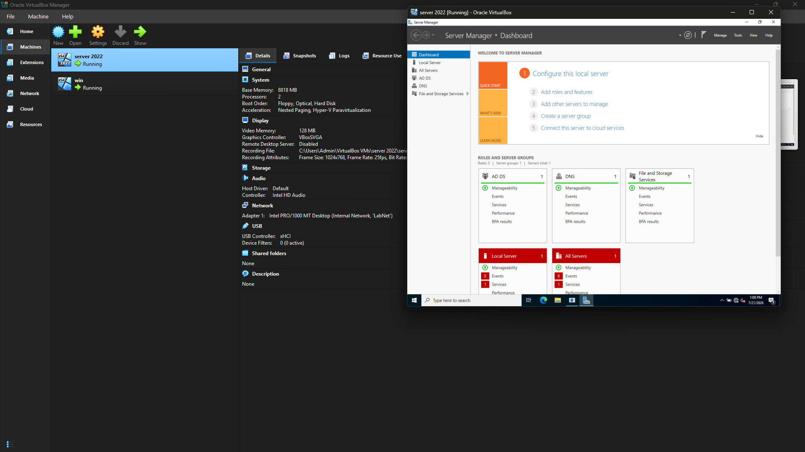
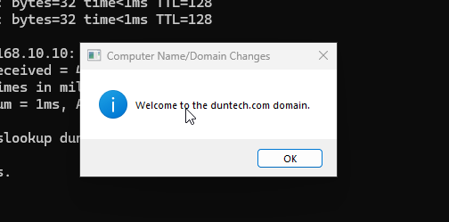

# 🖥️ Lab 01 - Active Directory Domain Controller

## Overview

In this lab, I deployed a Windows Server 2022 Domain Controller by installing Active Directory Domain Services (AD DS), promoting the server to a Domain Controller, creating users, and joining a Windows 11 client to the domain.

---

## Objective

- Install Windows Server 2022
- Configure Active Directory Domain Services (AD DS)
- Promote the server to a Domain Controller
- Create Active Directory users
- Join a Windows 11 client to the domain
- Verify successful domain authentication

---

## Lab Environment

| Component | Details |
|-----------|---------|
| Hypervisor | VirtualBox |
| Server OS | Windows Server 2022 |
| Client OS | Windows 11 |
| Services | Active Directory Domain Services |
| DNS | Windows DNS |

---

## Lab Architecture

```text
                 Internet
                     │
             VirtualBox Network
                     │
        ┌─────────────────────────┐
        │ Windows Server 2022      │
        │ Domain Controller        │
        │ AD DS + DNS              │
        └──────────┬───────────────┘
                   │
        ┌──────────▼───────────────┐
        │ Windows 11 Client        │
        │ Joined to Domain         │
        └──────────────────────────┘
```

## Screenshot
The image below shows the successful installation of Windows Server 2022 (Desktop Experience) running in a VirtualBox virtual machine.


The Windows 11 client was successfully joined to the Active Directory domain and authenticated using domain credentials.



